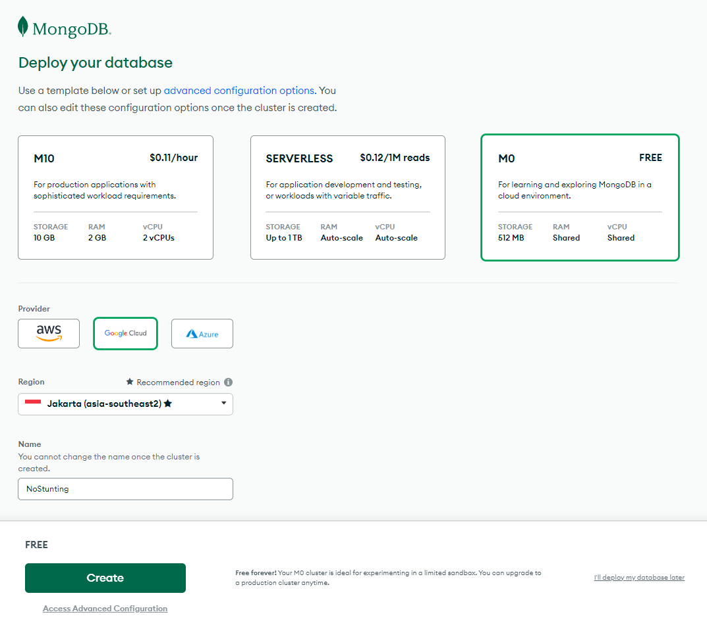
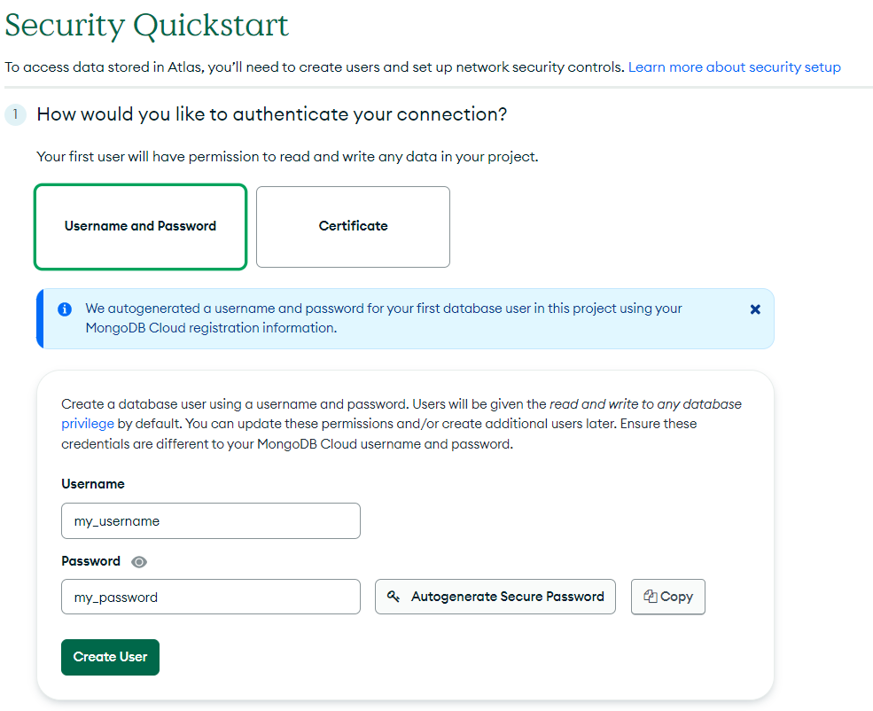
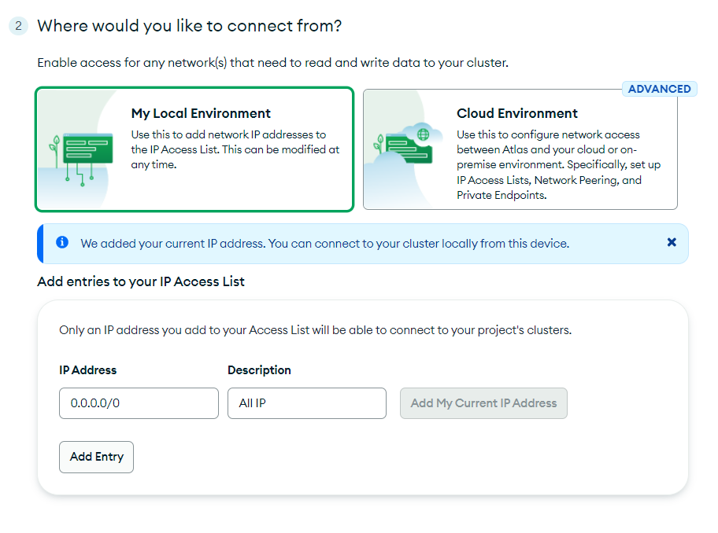
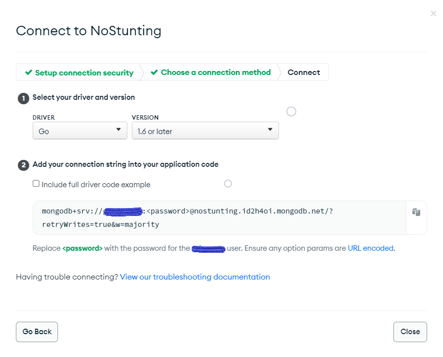

# Back-End No Stunting App

---

This is the source code for the backend development of the No Stunting App.

> The API Documentation for deployed backend system can be seen in
>
> [https://documenter.getpostman.com/view/12579961/2s93Jox6Dv](https://documenter.getpostman.com/view/12579961/2s93Jox6Dv)

---

This documentation is divided into three sections, including:

> 1. [How to clone](#how-to-clone)
> 2. [How to run on your system](#how-to-run-on-your-system)
> 3. [How to deploy in Google Cloud](#how-to-deploy-in-google-cloud)

---

## How to clone

After cloning this repository, you can follow several steps, including:

> 1. [Install Golang](#install-golang)
> 2. [Setup MongoDB Atlas](#setup-mongodb-atlas)
> 3. [Install Dependencies](#install-dependencies)

### Install Golang

Installing **Golang** is quite easy, it can be done in several steps, including:

1. Download Golang Install in this [link](https://go.dev/dl/).
2. Click Install
3. Proceed as the installation in general.

### Setup MongoDB Atlas

This project use MongoDB as Database Management System, and use [MongoDB Atlas](https://www.mongodb.com/atlas/database) as DBMS Environment. You can setup the MongoDB Atlas by several steps, but make sure you have account in MongoDB Atlas (It is free), if you don't have account, easily you can register [here](https://www.mongodb.com/cloud/atlas/register).

After you have an account, you can follow the next step, including:

1. Create Cluster

    Choose Cluster do you want and the specification, here for example, you can choose **M0** with free payment, Google Cloud Provider, choose the Region and define the Cluster Name. and Click **Create**.

      

2. Create Database Account

    After creating cluster, you need to create user for read and write for any data in your project.

    > my_username can be replaced with your own username
    >
    > my_password can be replaced with your own password

      

3. Add IP Access List

    To allow IP that is connected to database, you can add IP. Here we using `0.0.0.0/0` for allowing all of connection from all IP. Easily click **Add Entry**

      

4. Get Connection String

    When you already setup your database, you will be redirected to **Database Deployment**, here, you can click **Connect** button.

      

    Choose **Connect your application**, and will appear modal box a modal box will appear more or less like this.

      

    Copy the connection string and replace blue sensored text with your username and `<password>` with password you entered before.

### Install Dependencies

Dependencies for projects is an important things, you need to install to your currenct project, simply, in Go we just only :

1. Change your active directory to your cloned directory
2. Write command `go get`

---

## How to run on your system

Navigate active directory to your project directory, and you may continue... :)

> 1. [Setup Environment Variables](#setup-environment-variables)
> 2. [Run](#run)

### Setup Environment Variables

If you see `env.example` in this repository, it is the example ENV file that will be loaded in the runtime. So, the next steps is:

1. Copy `env.example` file to the same directory and give name `.env`.
2. Open the file, and you will see code like this:

    ```env
    MONGOURI="YOUR_MONGODB_URI"
    ```

3. Replace "YOUR_MONGODB_URI" with Connection String you created before.

    ```env
    MONGOURI=mongodb+srv://<username>:<password>@<clustername>.t46b00s.mongodb.net/?retryWrites=true&w=majority
    ```

4. Save the file

### Run

To check and make sure the setup is already done, we need to check with trying to run the system, so let us do it! :D

Stay in project directory, run command `go run index.go`

If the last line of the terminal output is:

```bash
[GIN-debug] Listening and serving HTTP on :8080
```

The code is already setup and successfully running. :)

---

## How to deploy in Google Cloud

We need to deploy a system for the benefit of flexible access, here we use Google Cloud with it's Cloud Run, **before those**, you need to upload **your setup project** to your own Github.

1. Create Service

    In Cloud Run Main Panel, simply click **Create Service**

    

2. Setup Cloud Build, Sservice name, region, CPU Allocation and Autoscalling

    

    By Clicking **SET UP WITH CLOUD BUILD**, will appear side section Set Up Cloud Build.

    

    Before this, you have already deploy your repository in your Github.

    > If you are new in Google Cloud, you have to configure connection between your Github with Google Cloud.

    

    Simply click **Save**

3. Authentication

    

4. Setup Environment Variable

    Expand Collapsable **Container, Networking, Security**, in Section **Environment variable**, you can input your MONGODB Connection String like picture below:

    

5. Click **CREATE**
